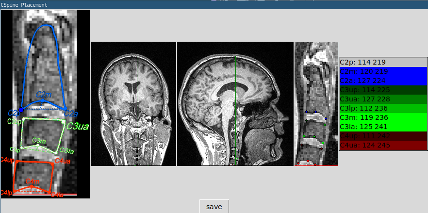

# CSpine Position annotation



1. click full image sagittal and coronal to find the best zoom
2. click the zoom window to set points, follow along with the left guide image
  * right click to go back and redo
3. click save


The `save` button will create a file like `{imgbase}_cspine-{user}_create-{timestamp}.tsv`

```
# timestamp=2024-10-05 13:59:57.119815; input=mprage.nii.gz; user=foranw; sag=96; cor=119;crop=(90, 255); zoom=3;
label   x       y       sag_i   timestamp       user
C2p     114     219     96      2024-10-05 13:59:28.582055      foranw
C2m     121     219     96      2024-10-05 13:59:29.987715      foranw
C2a     128     223     96      2024-10-05 13:59:31.499080      foranw
C3up    114     226     96      2024-10-05 13:59:33.070530      foranw
⁞
```

All placements are recoded in `cspine.db`. See [`schema.txt`](schema.txt).

## Data

Each dataset has it's own directory with a run script and .tsv annotations file. All clicks across datasets are stored in the unified `cspine.db`
  * `spa/`
  * `habit/` 
  * `pet/`
  * `ncanda/`
